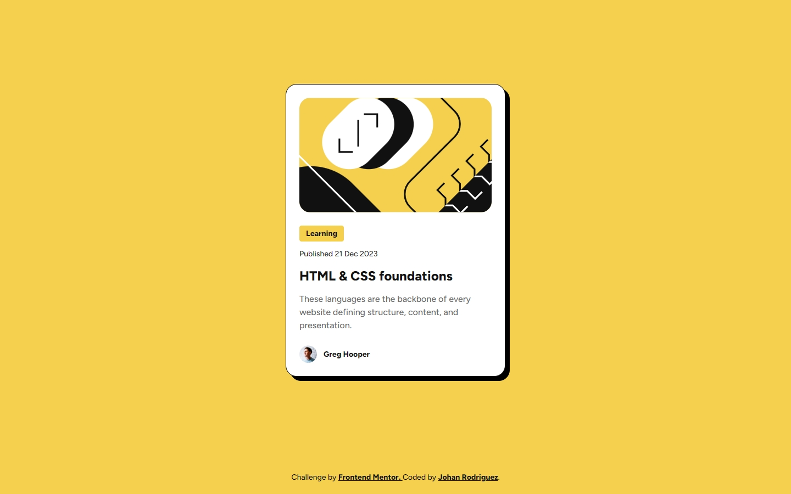

# Frontend Mentor - Blog preview card solution

This is a solution to the [Blog preview card challenge on Frontend Mentor](https://www.frontendmentor.io/challenges/blog-preview-card-ckPaj01IcS). Frontend Mentor challenges help you improve your coding skills by building realistic projects.

## Table of contents

- [Frontend Mentor - Blog preview card solution](#frontend-mentor---blog-preview-card-solution)
  - [Overview](#overview)
    - [The challenge](#the-challenge)
    - [Screenshot](#screenshot)
    - [Links](#links)
  - [My process](#my-process)
    - [Built with](#built-with)
    - [What I learned](#what-i-learned)
    - [Continued development](#continued-development)
    - [Useful resources](#useful-resources)
  - [Author](#author)
  - [Acknowledgments](#acknowledgments)

## Overview

### The challenge

Users should be able to:

- See hover and focus states for all interactive elements on the page

### Screenshot



### Links

- [Solution URL]()
- [Live Site URL](https://jdrodriguez2707.github.io/blog-preview-card/)

## My process

### Built with

- Semantic HTML5 markup
- CSS custom properties
- CSS functions
- Flexbox
- CSS Grid
- Mobile-first workflow

### What I learned

I learned how to make the font size responsive using the `clamp()` function. This function takes three parameters: the minimum font size, the viewport width at which the font size should be the minimum, and the maximum font size. The font size will increase linearly between the minimum and maximum font sizes as the viewport width increases. This allowed me to make the font size responsive without using media queries.

```css
.figtree-medium {
  font-family: 'Figtree', serif;
  font-weight: 500;
  font-size: clamp(
    1.4rem,
    calc(var(--base-font-size) * 0.4),
    1.6rem
  ); /* Min 14px, preferred calc, max 16px */
  line-height: 150%;
  letter-spacing: 0;
}
```

### Continued development

I want to continue learning about CSS functions and how to use them to make my code more efficient and maintainable. It's great to use these functions and avoid using media queries for every little change in the design.

### Useful resources

- [Nu HTML Checker](https://validator.w3.org/nu/) - This helped me to validate my HTML code and make sure it was correct with the W3C standards.

## Author

- Frontend Mentor - [@jdrodriguez2707](https://www.frontendmentor.io/profile/jdrodriguez2707)
- X - [@Johan79854000](https://twitter.com/Johan79854000)
- LinkedIn - [Johan Rodriguez](https://www.linkedin.com/in/jdrodriguez2707/)
- Instagram - [@johan_rodriguez_dev](https://www.instagram.com/johan_rodriguez_dev)

## Acknowledgments

I want to thank Frontend Mentor for providing this challenge, especially for the free+ challenges that allow me to practice with professional tools like Figma. It's been a great experience to learn from these challenges and I'm excited to continue learning and improving my skills.🚀
